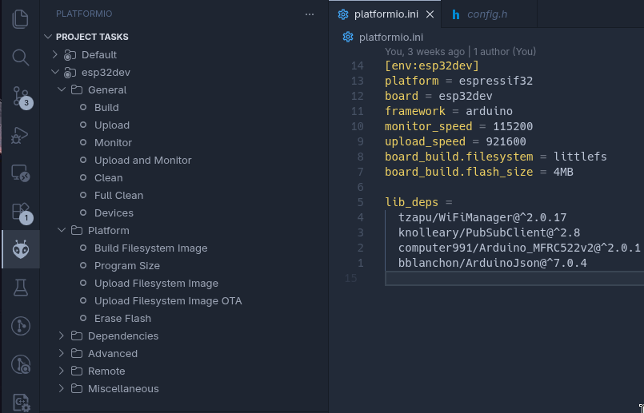

# Sistema Inteligente de Control de Acceso Híbrido

**Murray Agustín · Polanis Iván Valentín · Savenia Manuel**  
TP Integrador — I161 IoT

## Arquitectura


El ESP32 usa un **caché local** (LittleFS) como primera línea de verificación en cada lectura de tarjeta. Solo ante un cache miss consulta al servidor por MQTT. El servidor (Node-RED) es la única fuente de verdad y evalúa `enabled`, `expires_at` y `schedule` al responder.

## Requisitos

- Docker + Docker Compose
- PlatformIO (VS Code extension o CLI)
- Cuenta de Telegram para el bot

---

## Setup del stack servidor

### 1. Copiar y completar credenciales

```bash
cp .env.example .env
```

Editar `.env` con contraseñas reales para Mosquitto (`MOSQ_*`), el token del bot de Telegram, los IDs de chat de admins y, opcionalmente, `NODE_RED_CREDENTIAL_SECRET` y las credenciales de Grafana. **Las contraseñas de Mosquitto en `.env` deben coincidir con las que uses en el paso siguiente.**

### 2. Generar el archivo de contraseñas de Mosquitto

El archivo `mosquitto/config/passwd` se genera con `mosquitto_passwd`, creando un usuario por cada cuenta (`esp32`, `nodered`, `admin`) con las mismas contraseñas que pusiste en `.env`.

Con `mosquitto_passwd` instalado localmente:

```bash
mosquitto_passwd -c mosquitto/config/passwd esp32     # -c crea el archivo (primera vez)
mosquitto_passwd mosquitto/config/passwd nodered
mosquitto_passwd mosquitto/config/passwd admin
```

Alternativa sin instalar nada, usando el contenedor de Mosquitto (montando el directorio de config; `-b` toma la contraseña en la misma línea). Se crea el archivo con `touch` primero y **solo se usa modo append** (no `-c`): si `mosquitto_passwd -c` corre dentro del contenedor, deja el archivo como `root:root 0600` y el broker no puede leerlo:

```bash
touch mosquitto/config/passwd
docker run --rm -v "$PWD/mosquitto/config:/config" eclipse-mosquitto:2 \
  mosquitto_passwd -b /config/passwd esp32 TU_PASS_ESP32
docker run --rm -v "$PWD/mosquitto/config:/config" eclipse-mosquitto:2 \
  mosquitto_passwd -b /config/passwd nodered TU_PASS_NODERED
docker run --rm -v "$PWD/mosquitto/config:/config" eclipse-mosquitto:2 \
  mosquitto_passwd -b /config/passwd admin TU_PASS_ADMIN
```

### 3. Obtener el Token del Bot de Telegram

1. Hablar con [@BotFather](https://t.me/BotFather) en Telegram
2. Ejecutar `/newbot` y seguir las instrucciones
3. Copiar el token en `.env` → `TELEGRAM_TOKEN`

Para obtener tu chat ID, hablar con [@userinfobot](https://t.me/userinfobot) y copiar el `Id` en `TELEGRAM_ADMIN_IDS`.

### 4. Levantar el stack

```bash
docker compose up -d
```

Verificar que todos los servicios están saludables:

```bash
docker compose ps
```

Servicios disponibles:
- **Mosquitto**: `localhost:1883`
- **Node-RED**: `http://localhost:1880`
- **InfluxDB**: `http://localhost:8086`
- **Grafana**: `http://localhost:3000` (admin/admin por defecto)

---

## Setup del firmware ESP32

### 1. Crear config.h

```bash
cp esp32/src/config.example.h esp32/src/config.h
```

Editar `esp32/src/config.h`:
- `MQTT_HOST`: IP de la máquina donde corre Docker
- `MQTT_USER` / `MQTT_PASS`: credenciales del usuario `esp32` definidas en el paso anterior

### 2. Build y upload

Desde la interfaz de PlatformIO en VS Code:



General:
 - Seleccionar el entorno `esp32dev`
 - Clic en `Build`
 - Clic en `Upload`

Platform
 - Seleccionar el entorno `esp32dev`
 - Clic en `Build FileSystemImage`
 - Clic en `Upload FileSystemImage`


### 3. Provisioning WiFi

Al primer arranque (o si no hay WiFi guardada), el ESP32 levanta un AP llamado `ESP32-AccessControl`. Conectarse y configurar la red WiFi desde el portal cautivo en `http://192.168.4.1`.

---

## Comandos del Bot de Telegram

| Comando | Descripción |
|---|---|
| `/alta <uid> <nombre>` | Dar de alta un usuario |
| `/baja <uid>` | Deshabilitar usuario (invalida caché) |
| `/habilitar <uid>` | Habilitar usuario deshabilitado |
| `/deshabilitar <uid>` | Deshabilitar temporalmente |
| `/usuario <uid>` | Ver datos de un usuario |
| `/horario <uid> <dias_csv> <HH:MM> <HH:MM>` | Configurar franja horaria permitida |
| `/expira <uid> <ISO8601\|none>` | Configurar/quitar fecha de expiración |
| `/ultimos [n]` | Ver últimos n eventos (default 10) |
| `/lockdown on\|off` | Bloqueo global de accesos |
| `/ttl <segundos>` | Cambiar TTL del caché en el ESP32 |
| `/ayuda` | Ver todos los comandos |

### Ejemplo de horario

```
/horario AABBCCDD 1,2,3,4,5 08:00 18:00
```
Permite acceso de lunes (1) a viernes (5) entre las 08:00 y las 18:00.  
`days`: 0=domingo, 1=lunes, ..., 6=sábado.

### Ejemplo de expiración

```
/expira AABBCCDD 2025-12-31T23:59:59Z
/expira AABBCCDD none    # quita expiración
```

---

## Topics MQTT

| Topic | Dirección | Descripción |
|---|---|---|
| `access/door01/event` | ESP32 → Server | Telemetría de cada acceso (`granted`/`denied`) |
| `access/door01/request` | ESP32 → Server | Cache miss: solicita validación |
| `access/door01/response` | Server → ESP32 | Respuesta del servidor con `allowed` y `ttl` |
| `access/door01/command/invalidate` | Server → ESP32 | Borrar UID(s) del caché |
| `access/door01/command/lockdown` | Server → ESP32 | Activar/desactivar bloqueo global |
| `access/door01/command/config` | Server → ESP32 | Actualizar parámetros (TTL, etc.) |
| `access/door01/status` | ESP32 → Server (retained) | Heartbeat y Last Will (offline detection) |

---